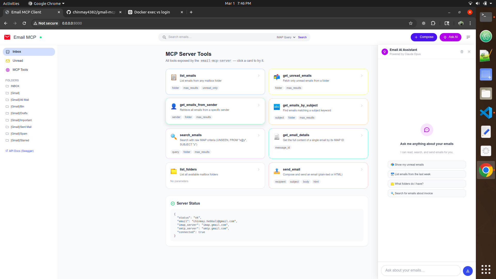

# Gmail MCP Server



An MCP (Model Context Protocol) server for reading and sending Gmail via IMAP/SMTP. Exposes Gmail operations as MCP tools usable by Claude and other AI models, and includes a web UI for managing your inbox directly in the browser.

## Features

- **List Emails**: Retrieve emails from any Gmail folder
- **Get Unread Emails**: Fetch only unread messages
- **Search Emails**: Search with IMAP search criteria (by sender, date, subject, etc.)
- **Get Emails from Sender**: Retrieve all emails from a specific sender
- **Get Emails by Subject**: Search by subject text
- **Send Emails**: Compose and send emails via SMTP
- **List Folders**: View all available Gmail folders
- **Get Email Details**: Fetch complete details of a specific email

## Prerequisites

- Docker installed on your system
- A Gmail account with IMAP enabled and an App Password generated

## Quick Start

### 1. Enable Gmail IMAP and generate an App Password

1. Enable 2-Factor Authentication: https://myaccount.google.com/security
2. Generate an App Password for Mail: https://myaccount.google.com/apppasswords
3. Note your Gmail address and the generated app password — you'll need them below

### 2. Clone and configure

```bash
git clone https://github.com/chinmay4382/gmail-mcp-server.git
cd gmail-mcp-server
cp .env.example .env
```

Edit `.env` with your credentials:

```
EMAIL_ADDRESS=your_email@gmail.com
EMAIL_PASSWORD=your_app_password
IMAP_SERVER=imap.gmail.com
SMTP_SERVER=smtp.gmail.com
ANTHROPIC_API_KEY=your_anthropic_api_key
```

### 3. Run with Docker

**Option A — Web UI (browser app):**

```bash
docker compose up email-ui
```

Then open http://localhost:8000 in your browser.

**Option B — MCP server (for Claude Desktop / MCP clients):**

```bash
docker compose up email-mcp-server
```

## Available MCP Tools

### list_emails
List emails from a folder.

**Parameters:**
- `max_results` (int, default: 10): Number of emails to retrieve
- `unread_only` (bool, default: false): Only return unread emails
- `folder` (string, default: "INBOX"): Gmail folder name

### get_unread_emails
Get unread emails from a folder.

**Parameters:**
- `max_results` (int, default: 10): Number of unread emails to retrieve
- `folder` (string, default: "INBOX"): Gmail folder name

### get_emails_from_sender
Get emails from a specific sender.

**Parameters:**
- `sender` (string): Email address of the sender
- `max_results` (int, default: 10): Number of emails to retrieve
- `folder` (string, default: "INBOX"): Gmail folder name

### search_emails
Search emails using IMAP search criteria.

**Parameters:**
- `query` (string): IMAP search query
- `max_results` (int, default: 10): Maximum results to return
- `folder` (string, default: "INBOX"): Gmail folder to search

**Query examples:**
- `UNSEEN` — Unread messages
- `FROM "user@example.com"` — Emails from a specific sender
- `SUBJECT "invoice"` — Emails with "invoice" in subject
- `FLAGGED` — Starred emails
- `SINCE "1-Jan-2024"` — Emails since a date
- `UNSEEN FROM "user@example.com"` — Combine criteria

### get_emails_by_subject
Get emails by subject text.

**Parameters:**
- `subject` (string): Subject text to search for
- `max_results` (int, default: 10): Maximum emails to retrieve
- `folder` (string, default: "INBOX"): Gmail folder to search

### send_email
Send an email.

**Parameters:**
- `recipient` (string): Recipient email address
- `subject` (string): Email subject
- `body` (string): Email body text
- `html` (bool, default: false): If true, body is treated as HTML

### get_email_details
Get full details of a specific email.

**Parameters:**
- `message_id` (string): Email ID from IMAP

### list_folders
List all available Gmail folders.

## Configuration

| Variable | Required | Default | Description |
|----------|----------|---------|-------------|
| `EMAIL_ADDRESS` | Yes | — | Your Gmail address |
| `EMAIL_PASSWORD` | Yes | — | Gmail App Password |
| `IMAP_SERVER` | No | `imap.gmail.com` | IMAP server |
| `SMTP_SERVER` | No | `smtp.gmail.com` | SMTP server |
| `ANTHROPIC_API_KEY` | Yes (Web UI) | — | API key for AI chat |

## Troubleshooting

### "Authentication failed"
- Make sure you're using a Gmail **App Password**, not your regular Gmail password
- Confirm IMAP is enabled in Gmail Settings → See all settings → Forwarding and POP/IMAP

### "Connection refused"
- Verify IMAP is enabled in your Gmail account settings
- Check that your firewall doesn't block port 993 (IMAP) or 587 (SMTP)

### "No module named 'mcp'"
- Rebuild the Docker image: `docker compose build`

## File Structure

```
gmail-mcp-server/
├── gmail_mcp_server.py   # MCP server entry point
├── gmail_client.py       # IMAP/SMTP client wrapper
├── api_server.py         # FastAPI REST server for the web UI
├── ui/
│   ├── index.html        # Web UI markup
│   ├── app.js            # Web UI JavaScript
│   └── styles.css        # Web UI styles
├── Dockerfile            # Docker build configuration
├── docker-compose.yml    # Docker Compose services
├── requirements.txt      # Python dependencies
├── .env.example          # Example environment variables
└── mcp-config.json       # MCP configuration example
```

## Security Notes

- Never commit your `.env` file — it contains live credentials
- Always use a Gmail App Password, not your account password
- The App Password grants access only to IMAP/SMTP, not your full Google account

## License

MIT License
